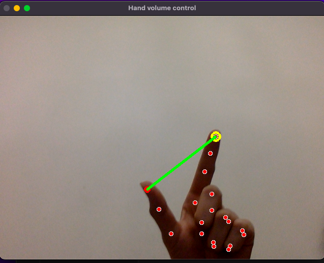

# 👌 Hand volume controller

**Hand volume controller** — регулятор громкости звука на устройстве с помощью жестов руки. Регулируйте уровень громкости на своем устройстве, просто изменяя расстояние между своим указательным и большим пальцем.

---

**Hand volume controller** — control the volume of the sound on the device using hand gestures. Adjust the volume on your device by simply changing the distance between your index finger and thumb.
